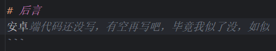

# ranjyaa_sleepy

似了没，如似🎉  
在线演示地址：[活着吗？如活](http://ranjyaa-alive.ranjyaa.top/)  
这里是后端代码，前端代码在[这里]()

# 介绍

> 感谢[芥子](https://github.com/1812z/sleepy)提供的灵感


使用Flask+SocketIO实现的一个实时监控电脑当前窗口标题的小工具，可以通过网页实时查看电脑当前窗口的标题信息，用于监控我似了没（）


# 核心文件

- service.py：服务端代码，负责接收客户端（win、mobile）发送来的窗口标题信息等，通过socket实时发送给前端页面

- watch_win.py：客户端代码，负责监控电脑行为，获取当前窗口的标题信息，通过http请求发送给服务端

- logger_config.py：日志配置文件

- gun.py：启动服务端容器的配置

# 使用方法

强烈建议使用单独的虚拟环境运行！！如conda等

1. 安装依赖  
   服务端和客户端所用到的依赖不一样，需要分别安装。如果都在本地运行则都需要安装。  
   分别进入到对应文件夹，执行以下命令

    ```shell
    pip install -r requirements.txt
    ```

2. 修改service.py中的相关配置后，启动命令

    ```shell
    python service.py
    ```

1. 修改watch_win.py中的相关配置后，启动命令

    ```shell
    python watch_win.py
    ```

> 如有需要，可以用docker打包服务端代码，然后扔到服务器上运行。使用生产环境的服务器容器gunicorn启动更加稳定

# 其他问题

1. 启动service.py时报错：
   ```
   RuntimeError: The Werkzeug web server is not designed to run in production. Pass allow_unsafe_werkzeug=True to the run() method to disable this error.
   ```  

- 原因：  
  Flask自带的服务器不适合在生产环境中使用，需要在启动服务的时候加上`allow_unsafe_werkzeug=True`参数
- 解决：  
  `service.py`的最底部修改为`socketio.run(app, host="0.0.0.0", port=5002, allow_unsafe_werkzeug=True)`

# 后言

安卓端的监控代码还没写。可以参考[芥子](https://github.com/1812z/sleepy)的仓库
> 这ai笑死我了  
